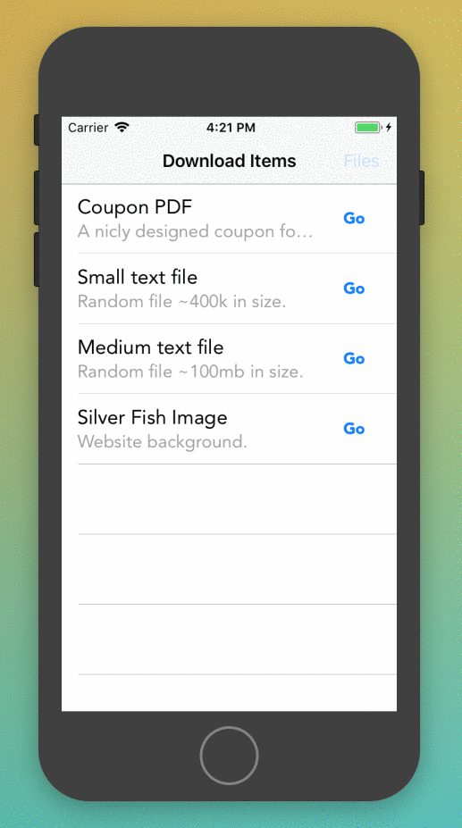

# Progress

Track the progress of the download of an HTTP resource from a list. Pause, restart and cancel those requests in-flight. Files are downloaded to the device and can be deleted to restart the demo.

Warning: The code is a litte bit old :-/

